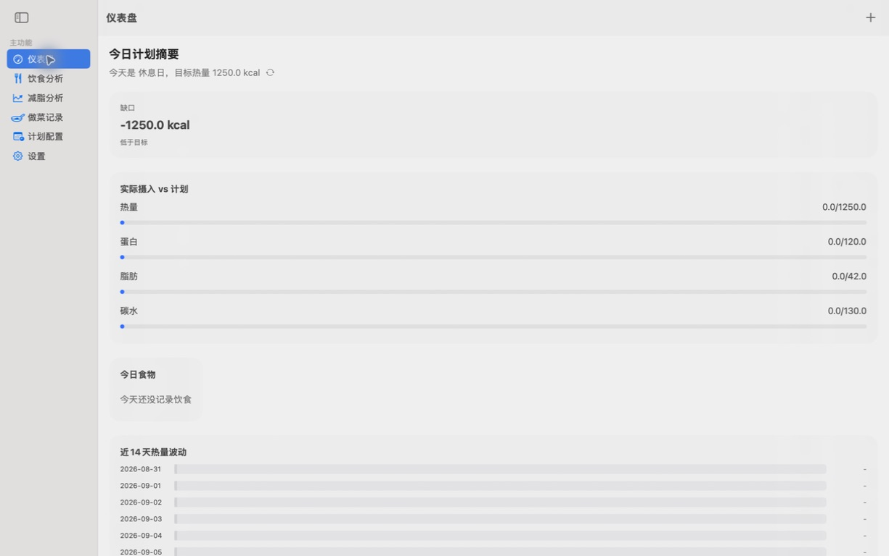
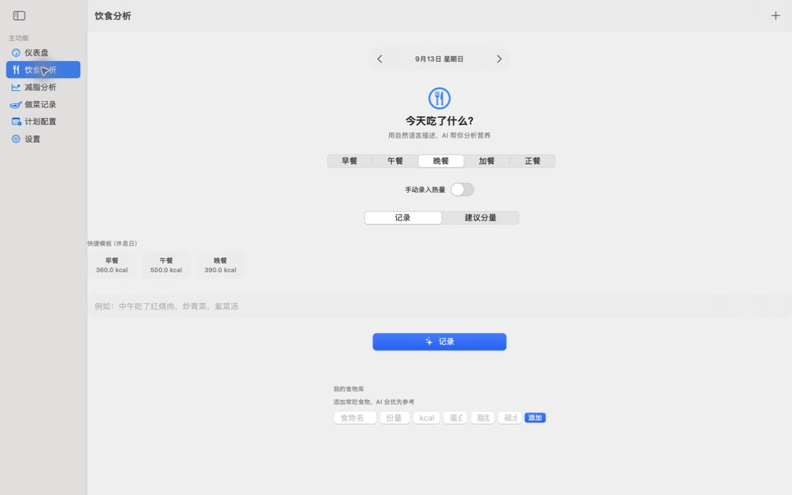
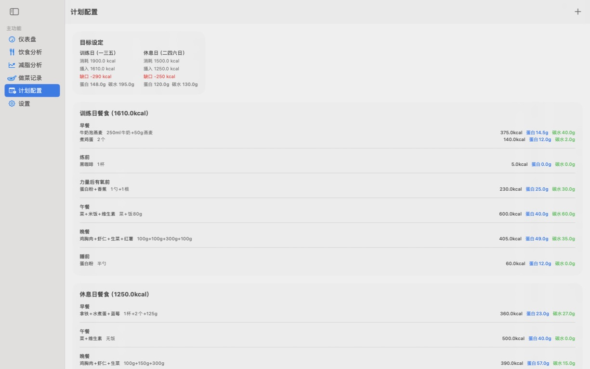

# 减脂助手 FatLossTracker

一个通过 vibe coding 完成的原生 macOS 减脂记录应用。它把每日饮食、宏量营养素、体重趋势、训练日计划和 AI 营养分析放在同一个桌面端工具里。



## 界面预览

<p align="center">
  
  
</p>

<p align="center"><sub>自然语言饮食分析 · 训练日与休息日计划</sub></p>

## 功能

- 记录早餐、午餐、晚餐与加餐，查看每日营养摄入和 14 天热量变化
- 支持手动录入，也可以通过兼容 OpenAI Chat Completions 协议的服务解析自然语言饮食描述
- 自定义常吃食物库，并按训练日/休息日使用饮食模板
- 记录体重与体脂趋势，并生成减脂建议
- 生成和保存家常菜谱
- 导出当天饮食 CSV

## 环境与运行

- macOS 14 或更高版本
- Swift 6
- Xcode，或版本匹配的 Swift toolchain 与 macOS SDK

开发运行：

```bash
swift run FatLossTracker
```

生成本地 `.app`：

```bash
./build-app.sh
```

生成的应用位于项目根目录的 `FatLossTracker.app`，该文件属于构建产物，不会提交到 Git。

## 项目结构

- `Sources/Views/ContentView.swift`：当前主要界面
- `Sources/AppState.swift`：应用状态、业务逻辑与 AI 请求
- `Sources/PersistenceController.swift`：Core Data 模型和本地存储
- `Sources/KeychainAPIKeyStore.swift`：API Key 的钥匙串读写

## 当前阶段

这是一个可用的早期版本，目前尚未接入 HealthKit。AI 返回属于估算结果，不能替代医生或注册营养师的建议。

